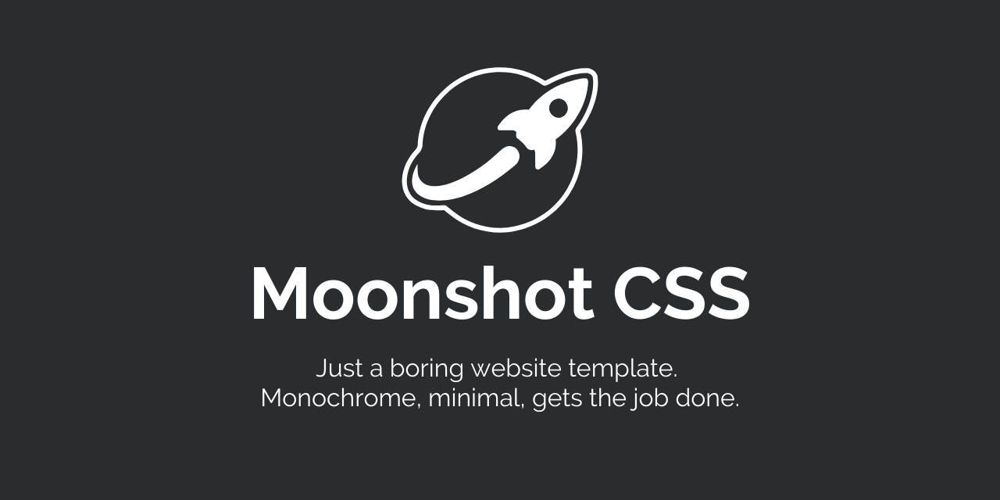

# Moonshot

Just a boring website template. Monochrome, minimal, gets the job done.

SCSS-based CSS framework with 20+ page templates for corporate/startup sites. Drop in, tweak 3 CSS variables, ship.

## Why Moonshot?

1. **Image-first design** — Ground your pages with full-bleed image-links. High reproducibility, easy originality — just swap the photos.
2. **Build today, deliver tomorrow** — Speed is king for startups. No config, no decisions, no rabbit holes. Pick a template, brand it, ship it.

## Quick Start

```bash
git clone https://github.com/ysnotksk/moonshot.git
cd moonshot
npm install
npm start
# -> http://localhost:8080/examples/
```

## What's Inside

- **21 page templates** — front page, services, blog, news, events, recruitment, about, contact, legal, etc.
- **40+ components** — buttons, cards, forms, navigation, hero, image-links, flow, accordion, pricing, testimonials
- **SCSS architecture** — `@use`/`@forward` modules, 30+ mixins, 15+ utility functions
- **Dark mode** — `data-theme="dark"` and you're done
- **~15 KB gzipped**

## Brand It

```css
:root {
  --ms-brand-primary: #2563eb;
  --ms-brand-secondary: #3b82f6;
  --ms-brand-accent: #1d4ed8;
}
```

That's it. Everything updates.

## Build

```bash
npm run build       # CSS + JS + HTML templates
npm run watch       # Dev mode with file watching
npm run lint        # Stylelint with auto-fix
```

## Project Structure

```
src/
├── abstracts/      # Variables, functions, mixins
├── base/           # Reset, typography, grid
├── components/     # UI components (BEM, ms- prefix)
├── utilities/      # Spacing, color, helper classes
├── pages/          # Pug templates
└── moonshot.scss   # Entry point

dist/               # Built CSS/JS (committed)
examples/           # Generated HTML pages
```

## Docs

- [Component Reference](docs/COMPONENTS.md)
- [Tech Stack](docs/00_tech_stack.md)

## License

MIT
